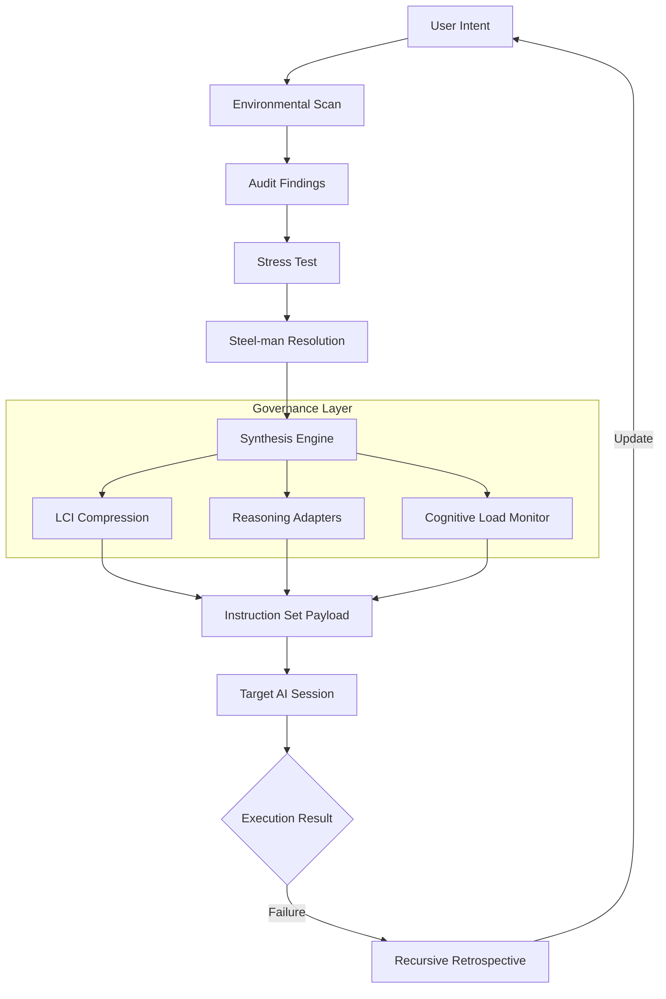

# Meta-Prompt Architect 🏛️

**C-RSP Level 5 Cognitive Governance System**

Meta-Prompt Architect is a state-of-the-art governance overlay designed to turn natural language into high-dimensional, production-ready instruction sets. It acts as a "compiler for intent," ensuring that AI assistants follow strict logical constraints, maintain specialized personas, and survive "Blind Man's Test" executability audits.

## 🚀 Core Cognitive Pipeline

The system follows a recursive three-phase pipeline to harden prompts:

1.  **Environmental Scan (Audit)**: Identifies implicit assumptions, edge cases, and the "Truth Surface" (required external data).
2.  **Stress-Test (Dialectical)**: Simulates a "Critic" and "Logic Specialist" to find vulnerabilities in the intent.
3.  **Synthesis (The Executable)**: Produces a final payload with a system role, cognitive stack, and binary verification gates.

## 🛠️ Key Features

- **Linear Context Injection (LCI)**: Proprietary "token squeezing" technology to maximize context window efficiency.
- **Cognitive Load Monitor**: Real-time density tracking to ensure prompts don't exceed model reasoning capacity.
- **Model-Specific Adapters**: Tailored reasoning logic for Claude 3.7, Gemini 2.0, GPT-4o, and specialized assistants like Cursor and Claude Code.
- **Recursive Error-Correction**: A "Retrospective" engine that analyzes failed AI steps to update the build contract.
- **PII Shield**: Integrated scanner to prevent sensitive data leaks during the prompt engineering process.

## 📊 Architecture

## 💻 Tech Stack

- **Frontend**: React 18, TypeScript, Tailwind CSS, Framer Motion
- **Icons**: Lucide React
- **Intelligence**: Google Gemini 2.0 Flash (Internal Reasoning Engine)
- **Deployment**: Cloud Run / Vite
